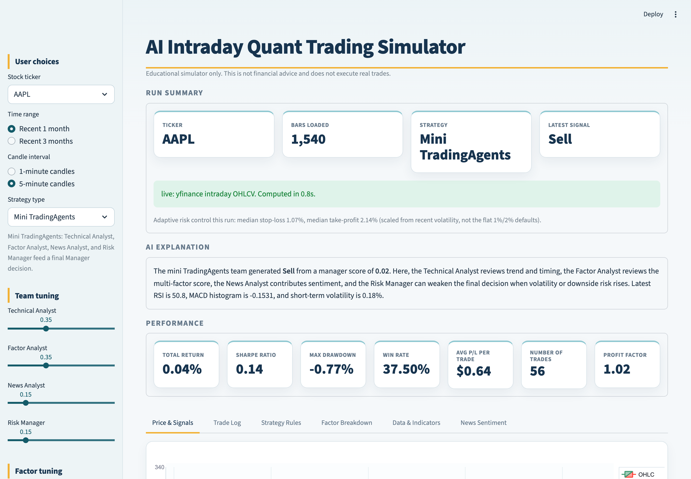
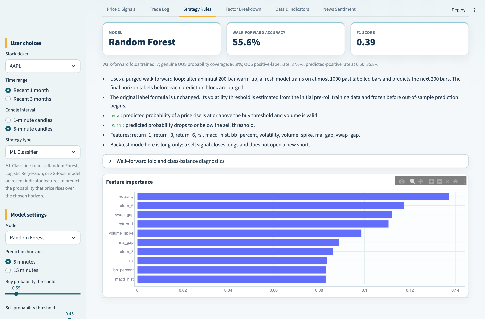
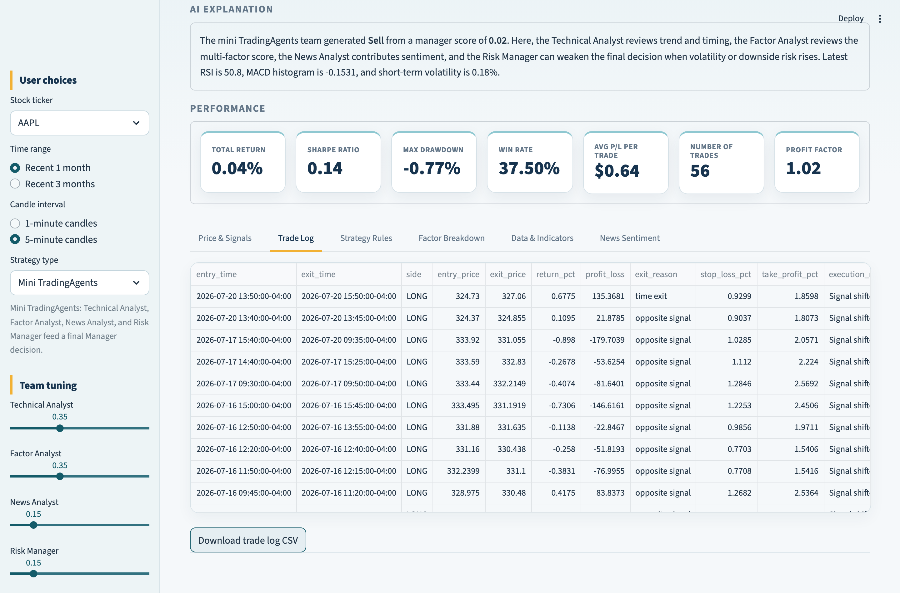

# AI Intraday Quant Trading Simulator

**Live app:** https://5557-must-group.streamlit.app/

An AI-powered finance application for intraday trading education. Users select a ticker, time range, candle interval, and strategy. The app loads minute-level OHLCV data, calculates short-term indicators, predicts short-horizon price direction, generates Buy/Sell/Hold signals, runs a backtest, and visualises trading performance.

The project deliberately reports honest results, including negative ones: the dashboard always shows sample sizes alongside performance, and every simulated trade — winners and losers — is published in this repository.



## Features

- Tickers: AAPL, TSLA, NVDA, CBA.AX
- Time ranges: recent 1 month or 3 months
- Candles: 1-minute or 5-minute
- Strategies:
  - Mini TradingAgents: a Technical Analyst, Factor Analyst, News Analyst, and Risk Manager feed a final Manager Buy/Hold/Sell decision
  - Multi-factor model: blends momentum, mean reversion, and volume/trend-flow z-scores with a volatility penalty
  - Freqtrade Sample Strategy: RSI cross conditions with TEMA and Bollinger middle-band trend guards
  - ML Classifier: trains a Random Forest, Logistic Regression, or XGBoost model on recent indicator features and trades on its predicted probability, with walk-forward accuracy/F1, per-fold class-balance diagnostics, and a feature-importance chart shown in the app
- Indicators:
  - VWAP
  - RSI
  - MACD
  - Bollinger Bands
  - Short-term volatility
  - Volume spike
  - Moving average crossover
- ML prediction:
  - Probability of price increasing over the next 5 or 15 minutes (ML Classifier strategy)
  - Random Forest, Logistic Regression, and optional XGBoost, evaluated with a purged walk-forward loop (see below) rather than a single train/test split
- News sentiment: keyword-based scoring of recent headlines, fed into the Mini TradingAgents News Analyst
- Backtesting:
  - Signals execute one completed bar after they are generated, and open positions are force-closed at the end of the evaluation window
  - Trade log with entry price, exit price, profit/loss, exit reason, and the stop-loss/take-profit used for that trade
  - Volatility-adaptive stop-loss/take-profit (scaled to recent volatility and the chosen max holding period), or fixed-percentage mode, plus position sizing
- Dashboard:
  - Total return
  - Sharpe ratio
  - Max drawdown
  - Win rate
  - Average profit per trade
  - Number of trades
  - Profit factor
  - Equity curve

## Installation

Requires Python 3.10 or newer.

```bash
git clone https://github.com/StarSharkk/5557-MUST-Group.git
cd 5557-MUST-Group

python -m venv .venv
source .venv/bin/activate        # Windows: .venv\Scripts\activate

python -m pip install -r requirements.txt
```

Dependencies (`requirements.txt`): `streamlit`, `pandas`, `numpy`, `plotly`, `scikit-learn`, `yfinance`, `xgboost`.

## Run

```bash
streamlit run app.py
```

Streamlit prints a local URL (default http://localhost:8501) and opens it in your browser. Or simply use the hosted version at https://5557-must-group.streamlit.app/ — no installation required.

## Usage guide

### Worked example 1 — compare a rule-based strategy against the ML classifier

1. In the sidebar, set **Stock ticker** to `TSLA`, **Time range** to `Recent 1 month`, **Candle interval** to `5-minute candles`.
2. Set **Strategy type** to `Mini TradingAgents`. The Run Summary panel confirms the data source (`live: yfinance intraday OHLCV`) and how many bars were loaded; the Performance panel shows total return, Sharpe ratio, win rate, and profit factor for that configuration.
3. Switch **Strategy type** to `ML Classifier`. The sidebar now exposes **Model settings** — choose Random Forest, Logistic Regression, or XGBoost, a 5- or 15-minute prediction horizon, and the buy/sell probability thresholds.
4. Open the **Strategy Rules** tab to see how well the model actually predicts, independently of whether it made money.



In the screenshot above the Random Forest reaches 55.6% walk-forward out-of-sample accuracy with an F1 of 0.39, across 7 folds covering 86.9% of the evaluation window — while the same run's total return is negative. This is the core lesson the app is built to demonstrate: **prediction accuracy does not imply trading profit.**

### Worked example 2 — inspect why an individual trade lost money

1. With any strategy selected, open the **Trade Log** tab.
2. Each row shows entry/exit time and price, return, profit/loss, and — most usefully — `exit_reason`: `stop-loss`, `take-profit`, `time exit`, `opposite signal`, or `end of window`. The stop-loss and take-profit percentages actually applied to that trade are also recorded, since they are scaled to volatility at entry.
3. Use **Download trade log CSV** to export every completed trade for your own analysis.



### Other tabs

- **Price & Signals** — candlestick chart with VWAP, Bollinger bands, and Buy/Sell markers, plus the equity curve.
- **Factor Breakdown** — the contribution of each agent (Mini TradingAgents) or factor (Multi-factor) to the latest decision, and how the score evolved over time.
- **Data & Indicators** — the computed indicator table for the most recent bars.
- **News Sentiment** — the headline sentiment score and the headlines behind it.

## API keys and environment configuration

**This application requires no API keys.** Market data comes from Yahoo Finance through the `yfinance` library, which is an unauthenticated public endpoint, and news headlines come from the same source. You can clone and run the project without any credentials.

No secrets are committed to this repository. If you extend the project with a service that does require a key (for example a paid data provider, or a hosted sentiment model), follow the `.env` pattern rather than hardcoding it:

1. Create a `.env` file in the project root — it is already covered by `.gitignore` and must never be committed:

   ```
   # .env — local only, never commit
   MARKET_DATA_API_KEY=your_key_here
   ```

2. Load it in code and read the value from the environment:

   ```python
   import os
   from dotenv import load_dotenv

   load_dotenv()
   api_key = os.environ["MARKET_DATA_API_KEY"]
   ```

3. On Streamlit Community Cloud, do not upload `.env`. Use **App settings → Secrets**, which exposes the same values via `st.secrets`.

The only environment variable this project itself recognises is optional: `YFINANCE_CACHE_DIR`, which relocates the yfinance timezone cache (defaults to `.yfinance-cache/`).

## Reproducible multi-stock scan

The ML Classifier uses a purged walk-forward loop: 200 bars of warm-up, a maximum
1,000-bar causal training window, and retraining every 200 bars. The original label
formula is unchanged, and its threshold is frozen from pre-roll history. XGBoost
receives the per-fold negative/positive class ratio as `scale_pos_weight`; folds with
one class are recorded as skipped rather than silently replaced by another model.

To produce the report matrix on live Yahoo Finance data:

```bash
python run_parameter_scan.py --output-dir analysis_results/scan_YYYYMMDD_HHMMSS
```

The scanner downloads one 60-day/5-minute snapshot per ticker, evaluates the latest
30 calendar days, and fails if any ticker falls back to demo data. It writes the
frozen OHLCV snapshots, `data_manifest.json`, `scan_runs_long.csv`,
`parameter_stock_matrix.csv`, `parameter_window_summary.csv`,
`ml_fold_diagnostics.csv`, `ml_window_comparison.csv`, `parameter_aggregate_summary.csv`, `all_trades.csv`, and `summary.md`. Every completed trade,
including losses, remains in `all_trades.csv`. Historical Yahoo news snapshots are
not available, so the scan uses an explicitly recorded neutral news score instead of
leaking current headlines into past bars.

The aggregate scan selected the Multi-factor default candidate
`momentum=0.55, mean_reversion=0.25, flow=0.20, volatility_penalty=0.20`:
it improved both Sharpe and profit factor on at least three of four tickers in
three of four sub-windows. This is a reproducible selection rule for the current
frozen sample, not a guarantee of future profitability; the original baseline and
all negative outcomes remain reported.

A second scan (`run_mta_weight_scan.py`) covers the Mini TradingAgents team weights and
Manager thresholds on the same frozen snapshots. Its `summary.md` also documents a
threshold-labelling error found in round one, retained as an audit record.

## Tests

```bash
python -m unittest discover -s tests
```

Five tests cover label maturity, walk-forward fold boundaries and coverage, the absence of
look-ahead in early predictions, class-balance handling, and the backtest's one-bar
execution delay and forced end-of-window close.

## Data notes

The app uses `yfinance` for intraday OHLCV data. Yahoo Finance enforces a hard history
limit on intraday bars — roughly 60 days for 5-minute candles and 7 days for 1-minute
candles — so long-range intraday requests may return nothing and fall back to clearly
labelled demo data. The banner under Run Summary always states whether the current run
used `live` or `demo` data.

Because the app re-downloads current market data on each run, the numbers it displays
will differ from the frozen scan results quoted in the written report. That is expected:
the report cites reproducible archived snapshots, while the app shows today's market.

## Known issues and planned future enhancements

**Known issues**

- **Short data window.** Yahoo's 60-day intraday ceiling means any single evaluation covers roughly 20 trading days of one market regime; results are regime-specific and cannot be generalised.
- **Small trade samples.** A typical configuration produces only 20–90 trades per ticker per month, so Sharpe ratios and win rates carry wide confidence intervals and no result here reaches conventional statistical significance.
- **News sentiment is keyword-based.** It cannot handle negation ("not bullish" scores positive) and only reads English headlines. Historical news snapshots are unavailable, so reproducible scans freeze the news input at neutral.
- **Strategies are correlated.** Mini TradingAgents embeds the multi-factor composite, and all rule-based strategies draw on the same RSI/MACD/Bollinger indicator pool, so they are design variants rather than four independent experiments.
- **Optimistic execution assumptions.** The backtest assumes 2 bps costs per side, fills at the next bar's close, long-only single positions, and zero market impact; live results would be worse.
- **The 3-month + 1-minute combination is not usable** because of the provider limit above, and will fall back to demo data.
- Streamlit reruns the whole script on every widget change, so switching to the ML Classifier triggers a retrain and can take tens of seconds on the free hosting tier.

**Planned future enhancements**

- Replace the keyword news scorer with a transformer-based financial sentiment model (FinBERT-class) over a timestamped news archive.
- Add a paid or broker data source (e.g. Alpha Vantage extended intraday, Interactive Brokers) for multi-year minute data, plus daily-frequency robustness studies over 5–10 years.
- Model slippage and order-book depth, and add cost sensitivity analysis, shorting, and portfolio-level risk management.
- Add in-context explanations of finance terms in the UI — user testing found the main barrier is domain knowledge, not the interface.
- Cache trained models between reruns to reduce ML Classifier latency.

## Repository layout

```
app.py                     Streamlit application (data, indicators, strategies, backtest, UI)
run_parameter_scan.py      Round-one multi-stock parameter scan
run_mta_weight_scan.py     Round-two Mini TradingAgents weight/threshold scan
tests/                     Unit tests for the strategy and backtest engine
analysis_results/          Frozen scan artefacts: OHLCV snapshots, manifests, matrices, all trades
docs/screenshots/          Screenshots used in this README
requirements.txt           Python dependencies
```

## Academic integrity and AI disclosure

This project is an educational simulator and not financial advice. It does not execute real trades.

AI coding assistants (Claude Code and Codex) were used during development for implementation, debugging, code review, and analysis tooling. All AI-generated code and text were reviewed by the team, all evaluation rules were fixed before scans were run, and the team takes responsibility for the contents of this repository. The full disclosure is included in the written report.
