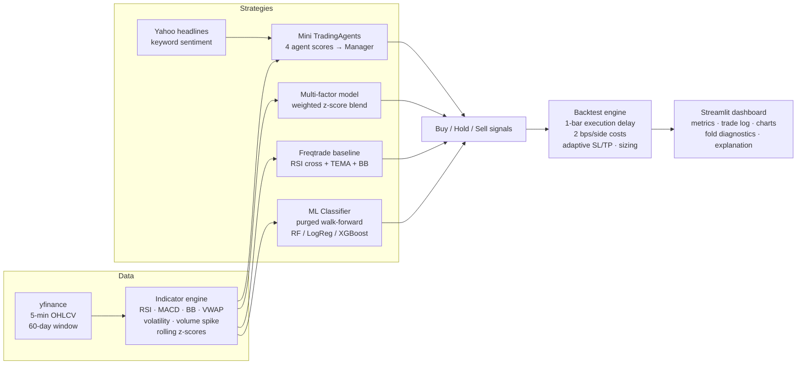

# AI Intraday Quant Trading Simulator

**FINS5557 Applied AI in Finance — Part A (Tech Team) Written Report**

**Live application:** [DEPLOYMENT URL — add after Streamlit Cloud deploy]
**Source code:** https://github.com/StarSharkk/5557-MUST-Group

> **DRAFT STATUS — before submission the team must:**
> 1. Complete the user testing in §d.3 with at least 3 real users (do **not** submit with the placeholder).
> 2. Verify every reference in §f against the original source and fix any details.
> 3. Fill in the contribution statement and the deployment URL.
> 4. Convert to the required document format and check the 15-page limit.

---

## a) Introduction

**Problem statement.** Retail interest in algorithmic and AI-assisted trading has grown rapidly, yet most tools available to students are either black boxes that emit "buy/sell" labels without justification, or professional platforms whose complexity hides the connection between raw market data, model output, and realised profit and loss. For a learner, the most important questions — *why* did the system trade, *how good* is the model really, and *what would this signal have earned after costs* — are exactly the ones that are hardest to inspect.

**Motivation.** We built an educational simulator that makes the full pipeline visible: live intraday data → engineered indicators → four transparent strategies (three interpretable rule/factor engines and one genuinely trained machine-learning classifier) → an execution-aware backtest → risk-adjusted performance metrics, with a plain-language explanation of every signal. The application deliberately reports honest, frequently negative results, because learning what does *not* work — and why — is the core educational outcome in quantitative finance.

**Target users and use case.** Finance and computer-science students, and self-directed learners studying quantitative trading. A user selects a ticker (AAPL, TSLA, NVDA, or CBA.AX), a time range, a candle interval, and one of four strategies; the app retrains/reruns everything live and displays signals, trades, and diagnostics. The app is explicitly **not** financial advice and executes no real trades.

**Objectives** (specific and measurable):

1. Implement four selectable strategies — a multi-agent rule ensemble, a multi-factor z-score model, a classic technical-analysis baseline, and a walk-forward ML classifier (Random Forest / Logistic Regression / XGBoost) — on live 5-minute data for four tickers.
2. Report out-of-sample model quality (accuracy, F1, per-fold class balance) from a purged walk-forward loop with ≥90% prediction coverage of the evaluation window.
3. Backtest with realistic frictions: one-bar execution delay, 2 bps per-side transaction costs, volatility-adaptive stop-loss/take-profit, and position sizing; report Sharpe ratio, maximum drawdown, win rate, and profit factor.
4. Select any default-parameter changes only through a pre-registered multi-stock stability rule (improvement on ≥3 of 4 tickers), with all negative results retained and published in the repository.

---

## b) Background and Literature Review

> **[TEAM: verify each citation against the original before submission; see §f.]**

**Technical analysis and intraday indicators.** Our three rule-based strategies build on standard indicators — RSI, MACD, Bollinger Bands, VWAP, and moving-average crossovers. Academic evidence on technical analysis is mixed: Lo, Mamaysky and Wang (2000) show, using nonparametric pattern recognition, that some chart patterns carry incremental information, while cautioning that raw profitability after costs is far from guaranteed. This motivates our design choice to treat indicator-based strategies as *transparent baselines* rather than claimed sources of alpha, and to always report performance net of transaction costs.

**Factor investing and mean reversion/momentum.** The multi-factor strategy standardises momentum, mean-reversion, and volume-flow signals as rolling z-scores and combines them with user-adjustable weights — a deliberately simplified, intraday analogue of the cross-sectional factor tradition. We keep the factor definitions fixed and expose the weights in the UI so users can see how sensitive results are to weighting choices, a sensitivity the factor literature emphasises.

**Machine learning for return prediction.** Gu, Kelly and Xiu (2020) provide large-scale evidence that tree-based ensembles and neural networks can improve return prediction relative to linear benchmarks, while stressing that predictability is small and concentrated. Krauss, Do and Huck (2017) find that random forests and gradient-boosted trees generate statistical-arbitrage signals on S&P 500 constituents, but that profitability erodes sharply after costs in later periods. Our results reproduce this pattern in miniature: walk-forward accuracy of 51–61% (against a ~50% naive baseline) frequently fails to survive execution frictions — a finding we surface to users rather than hide (§d).

**Backtest overfitting and evaluation discipline.** Bailey, Borwein, López de Prado and Zhu (2014) show how easily repeated parameter search on a fixed sample manufactures spurious "profitable" strategies, and López de Prado (2018) develops the standard defences: walk-forward evaluation, purging of overlapping labels, and scepticism toward any single-window result. These two works directly shaped our methodology: the ML classifier uses a purged walk-forward loop with a frozen label threshold, and every parameter change to app defaults had to pass a **pre-registered** stability rule across four tickers and four evaluation sub-windows, with all negative outcomes retained in the published scan artifacts (§c, §d).

**Multi-agent trading frameworks.** Recent work explores decomposing trading decisions into cooperating specialist agents (e.g., the TradingAgents LLM framework of Xiao et al., 2024 — *verify*). Our "Mini TradingAgents" strategy borrows the organisational metaphor — Technical Analyst, Factor Analyst, News Analyst, and Risk Manager feeding a Manager decision — but implements each agent as a transparent, deterministic scoring function rather than an LLM, trading expressive power for full inspectability and reproducibility, which suits an educational tool.

**Existing applications.** Freqtrade (open-source crypto/equities bot) supplies mature backtesting infrastructure and community strategies — our "Freqtrade Sample Strategy" reimplements the RSI-cross + TEMA + Bollinger middle-band logic of its documentation example as a recognisable baseline. QuantConnect/Lean and TradingView offer far richer engines but are oriented to practitioners; neither exposes model diagnostics (per-fold class balance, OOS coverage) at the level a learner needs. Our contribution is not a better trading engine but a **glass-box teaching instrument**.

**Why this technical approach.** We chose (i) classical ML over deep learning because our data budget (≈4,600 five-minute bars per ticker) cannot support deep architectures without severe overfitting risk; (ii) walk-forward over a single train/test split after measuring that the split left only ~30% of the window tradeable (§c.5); and (iii) rule-based agents over LLM agents for determinism, zero inference cost, and explainability. Streamlit was selected over Flask/Django because reactive re-execution suits a parameter-exploration tool and minimises engineering overhead unrelated to the learning goals.

---

## c) Methodology

### c.1 System architecture



*(If the submission format cannot render Mermaid, export this diagram as an image.)*

### c.2 Dataset

| Property | Value |
|---|---|
| Source | Yahoo Finance via `yfinance` (free tier) |
| Instruments | AAPL, TSLA, NVDA (NASDAQ); CBA.AX (ASX) |
| Interval / window | 5-minute OHLCV; 60-day download (provider's hard limit for 5-minute history), e.g. AAPL 2026-04-22 → 2026-07-17, 4,680 raw bars |
| Evaluation window | Most recent 30 calendar days (~1,560 bars/ticker); the preceding ~30 days provide causal indicator and model warm-up ("pre-roll") |
| Features (10) | `return_1/3/6`, `rsi`, `macd_hist`, `bb_percent`, `volatility`, `volume_spike`, `ma_gap`, `vwap_gap` |
| Label | 1 if forward return over the chosen horizon exceeds a volatility-scaled threshold `max(σ₁·√h·0.25, 0.05%)`; threshold estimated once from pre-roll data and **frozen** |
| Preprocessing | Rolling-window indicator computation; ±∞→NaN; leading NaN rows dropped; labels only created once matured (final `h` bars never labelled) |
| Integrity | Scan snapshots frozen to CSV with SHA-256 hashes in `data_manifest.json`; the scan aborts if any ticker falls back to demo data |

The 60-day ceiling is a provider constraint we verified empirically (Yahoo rejects longer 5-minute requests with an explicit error), not a design choice; its consequences are assessed in §d.4.

### c.3 Models and selection rationale

Four strategies, deliberately spanning the interpretability–flexibility spectrum:

1. **Mini TradingAgents** — four deterministic "agents" (Technical, Factor, News, Risk) each output a bounded score; a Manager combines them with user-set weights and trades on thresholds with a Bollinger-middle trend filter. Chosen to teach ensemble/committee decision structure with full transparency.
2. **Multi-factor model** — momentum, mean-reversion, and flow z-score composites minus a volatility penalty. Chosen as the minimal honest analogue of factor investing at intraday frequency.
3. **Freqtrade Sample Strategy** — RSI-cross entries/exits gated by TEMA and the Bollinger middle band; a widely recognised open-source community baseline against which the "AI" strategies must justify themselves.
4. **ML Classifier** — Random Forest (default), Logistic Regression, or XGBoost predicting P(price up over 5/15 min). Trees were preferred over deep nets for our sample size (per-fold training ≤1,000 bars); XGBoost receives the per-fold negative/positive ratio as `scale_pos_weight`, and the other models use balanced class weights, because intraday label distributions proved severely skewed on some tickers (§d.2).

### c.4 Development process and tools

Python 3.13; Streamlit (UI), pandas/NumPy (data), scikit-learn + XGBoost (models), Plotly (charts), yfinance (data). Git/GitHub with feature branches and reviewed merges (`main` protected by team convention; teammate work merged from `RUOYUN-WU` after code review and a five-test unit suite passed). Deployed on Streamlit Community Cloud. **AI-tool disclosure:** Claude Code (Anthropic) and Codex (OpenAI) were used as pair-programming assistants for implementation, debugging, code review, and analysis tooling; all design decisions, evaluation rules, and this report's claims were reviewed and are owned by the team.

### c.5 Challenges and solutions (selected)

| Challenge | Diagnosis | Solution |
|---|---|---|
| Fixed 1%/2% stop-loss/take-profit almost never triggered on 5-minute bars | Typical 5-min move ≪ 1%, so "risk control" was inert and exits were dominated by signal flips | Volatility-adaptive limits: `SL = k_sl · σ · √(min(hold, 60))`, `TP = k_tp · σ · √(min(hold, 60))`, clipped to sane bounds; per-trade limits recorded in the trade log |
| Single 70/30 chronological split left only ~30% of the window tradeable and as few as 9 trades (CBA.AX) | Training rows produce no signals; small OOS sample made metrics (e.g., a spurious Sharpe 2.67 on 9 trades) statistically meaningless | Purged walk-forward: 200-bar warm-up, ≤1,000-bar causal training window, retrain every 200 bars, labels purged so no training label's horizon overlaps the prediction block; OOS coverage rose to ~95.6% (§d.2) |
| Same-bar execution let a signal computed on a bar's close trade at that same close | Look-ahead at execution level | All signals shifted one completed bar before execution; open positions force-closed at window end and labelled `end of window` |
| Severe class imbalance on some tickers (e.g., 68.6% accuracy with F1 0.04) | Model predicting almost one class; accuracy misleading | Balanced class weights / `scale_pos_weight`; per-fold confusion matrices, label rates and predicted-positive rates surfaced in the UI's fold-diagnostics expander |
| Live headlines would leak future news into historical bars during scans | No historical news snapshots on the free tier | Scans freeze news input at neutral (0.0) and record this explicitly as a limitation |
| Risk of backtest-overfitting while tuning defaults | Repeated search on one frozen sample | Pre-registered stability rule (§d.1) fixed before scanning; all 60 configurations × 4 tickers × 4 sub-windows published, including failures |

---

## d) Results and Evaluation

All figures below are from the frozen, reproducible scan `analysis_results/scan_20260718_1602` (run 2026-07-18; 30-day evaluation window; 2 bps/side; one-bar execution delay; volatility-adaptive risk limits unless stated). Anyone can regenerate the matrix with `python run_parameter_scan.py`.

### d.1 Application performance under the pre-registered rule

**Rule (fixed before scanning):** a parameter change is "stable" only if it improves *both* Sharpe ratio and profit factor versus the app-default baseline on **≥3 of 4 tickers**, has positive pooled profit-factor evidence, and produces no zero-trade ticker. Everything else is retained but labelled inconclusive.

**Baseline (app defaults, walk-forward ML, SL 1.5σ/TP 3σ):**

| Strategy | AAPL | TSLA | NVDA | CBA.AX |
|---|---|---|---|---|
| Mini TradingAgents | +0.85% / S 4.77 | −0.19% / S −0.91 | −0.98% / S −3.53 | +0.60% / S 4.48 |
| Multi-factor | +1.40% / S 4.74 | −0.34% / S −1.11 | −1.35% / S −3.91 | +0.10% / S 0.57 |
| Freqtrade baseline | +0.32% / S 1.54 | −0.74% / S −2.01 | −0.52% / S −1.54 | +0.83% / S 5.01 |
| ML (RF 0.55/0.45) | +0.53% / S 1.62 | −1.79% / S −3.95 | +0.11% / S 0.32 | −0.08% / S −0.52 |

*(cell = 30-day total return / Sharpe; full table incl. drawdown, win rate, PF, trades in `parameter_stock_matrix.csv`)*

**Configurations passing the stability rule (full evaluation window):**

| Configuration | Both-improved | Pooled PF | Per-ticker (return / Sharpe) |
|---|---|---|---|
| **ML XGBoost, buy 0.60 / sell 0.48** | **4/4** | **1.183** | AAPL +0.92%/2.84 · TSLA +1.59%/3.83 · NVDA −0.86%/−2.27 · CBA.AX +0.13%/1.12 |
| Multi-factor, SL 1.5σ/TP 4σ | 4/4 | 1.015 | AAPL +1.46%/4.96 · TSLA −0.16%/−0.49 · NVDA −1.28%/−3.72 · CBA.AX +0.11%/0.68 |
| Multi-factor weights 0.55/0.25/0.20/0.20 | 3/4 | 1.165 | AAPL +1.79%/5.54 · TSLA +1.10%/3.34 · NVDA −1.22%/−3.84 · CBA.AX −0.01%/−0.04 |

The third row was additionally the only configuration meeting the 3-of-4-ticker rule in **3 of 4 evaluation sub-windows**, and was therefore adopted as the new Multi-factor default. We state plainly: this is a data-window candidate chosen by a reproducible rule, **not** a claim of future profitability. NVDA remained negative under every configuration tested — reported, not hidden.

### d.2 ML model effectiveness

- **Against baseline:** walk-forward OOS accuracy ranged ≈51–61% across tickers/folds versus a ~50% naive coin-flip and versus the Freqtrade rule baseline above. Balanced accuracy and per-fold confusion matrices are shown in-app; pooled OOS label-positive and predicted-positive rates flag imbalance.
- **The honest headline: prediction quality ≠ trading profit.** Accuracy a few points above 50%, at 29–87 trades per month, frequently fails to clear 4 bps round-trip costs — visible in TSLA (−1.79% at 56.8% fold-level accuracies).
- **Walk-forward vs the old 70/30 split (paired, same frozen data):** coverage 30.0% → 95.6% of bars with genuine OOS probabilities; trades AAPL 43→60, TSLA 64→87, NVDA 47→58, CBA.AX 9→29. Mean Sharpe delta was **−1.378** — the old split's flattering numbers (e.g., CBA.AX Sharpe 2.67 on 9 trades) were small-sample artefacts, and we accepted the *worse-looking but statistically defensible* estimate. Per-ticker pairs are in `ml_window_comparison.csv`.

### d.3 User testing — **[TO BE COMPLETED — do not submit until done]**

> Assessment requires ≥3 users with a structured instrument. **No user testing has been conducted yet; nothing here may be fabricated.** Protocol prepared for the team:
>
> **Participants:** ≥3 (target 5) students not on the team; record degree/背景 and prior trading knowledge (none/basic/advanced).
> **Tasks (think-aloud, ~15 min):** (1) load TSLA · 1 month · 5-min; (2) switch strategies and state which is most trustworthy and why; (3) find the walk-forward accuracy and one limitation of the ML model from the UI alone; (4) locate and interpret one losing trade in the trade log.
> **Instrument:** System Usability Scale (SUS, 10 items, 1–5) plus 4 Likert items — "I understand *why* the app issued its latest signal"; "The AI explanation used honest language about uncertainty"; "I could explain profit factor to a classmate after using the app"; "I would use this to study trading concepts" — plus two open questions (most confusing element; one improvement).
> **Report here after testing:** participant table, mean SUS, per-item medians, and 3 concrete UI changes made in response.

### d.4 Limitations and future work

1. **Data ceiling.** Yahoo's 60-day/5-minute hard limit caps any single evaluation at ~20 trading days per ticker; results are regime-specific by construction. *Future:* paid or broker APIs (e.g., Alpha Vantage extended intraday, IBKR) for multi-year minute data; daily-frequency robustness studies over 5–10 years.
2. **Statistical power.** 22–87 trades per cell gives wide confidence bands on Sharpe and win rate; no cell here reaches conventional significance. We mitigate by pooling across tickers and sub-windows and by refusing single-window claims, but cannot cure it at this data budget.
3. **No universally profitable strategy.** Under app defaults 9 of 16 strategy×ticker cells were negative; NVDA was negative in all tested configurations. Consistent with efficient-markets expectations for liquid large caps at 5-minute frequency using public indicators.
4. **News agent is trivial NLP.** Keyword counting without negation or context, frozen to neutral in scans for leakage reasons. *Future:* transformer-based sentiment (e.g., FinBERT-class models) with timestamped news archives.
5. **Correlated strategies.** Mini TradingAgents and Multi-factor share factor components; the four strategies are not independent experiments and we do not present them as such.
6. **Single-asset, long-only execution.** No portfolio interaction, shorting, or market-impact modelling; 2 bps costs are optimistic for retail.

---

## e) Ethical Considerations

**Bias in the AI system.** (i) *Data bias:* models train on ≤60 days of a single regime; a classifier fit in a drifting market will systematically mislearn reversal behaviour — we surface per-fold label-rate drift in the UI so users can see regime dependence rather than assume stationarity. (ii) *Class imbalance:* documented cases (F1 0.04 at 68.6% accuracy) show how a skewed label base rate can make a near-constant predictor look "accurate"; we mitigate with balanced class weights/`scale_pos_weight` and display balanced accuracy and confusion matrices, a design decision tied directly to this identified bias. (iii) *Survivorship/selection:* four large liquid names were chosen for data reliability; results must not be generalised to small caps, and the report says so.

**Privacy and data security.** The application collects no personal data, requires no login, stores no user state server-side, and processes only public market data; no cookies or analytics are added. Scan artefacts contain market data and hashes only. API keys are not required; the repository contains no secrets (verified before each push), and dependency versions are pinned in `requirements.txt`.

**Responsible-AI principles applied (with concrete design decisions).** *Transparency:* every signal ships with a plain-language explanation, model name, OOS accuracy/F1, coverage, and fold diagnostics — not just a label. *Honesty about uncertainty:* negative results are published (all 21,843 scan trades incl. losses are in the repo); the UI never displays a profitability claim without sample size. *Non-deception:* an "Educational simulator — not financial advice" banner is permanently visible; no real-money execution path exists. *Reproducibility:* frozen snapshots + SHA-256 manifests + a one-command scan script make every reported number regenerable. *Human agency:* the tool recommends nothing; users set every parameter.

**Societal impact.** Positive: lowers the barrier to genuinely understanding quantitative methods, including their failure modes — an antidote to "AI trading" hype marketing. Risks: a learner could misread simulator results as an endorsement of live trading; mitigated by the persistent disclaimer, honest negative metrics, and this report's explicit statistical caveats. We judge net impact positive precisely because the tool teaches scepticism.

**Regulatory context.** The app provides general educational information, not personal financial product advice; it does not execute transactions. *Privacy Act 1988 (Cth)/GDPR:* no personal information is collected or processed, so obligations are minimal, and remaining exposure (e.g., server logs on the hosting platform) is documented rather than denied. *APRA CPS 234* applies to APRA-regulated entities, which we are not; we nonetheless borrowed its spirit — information-asset identification (data manifests), integrity controls (hashes, tests), and change control (branch review before merge). If the tool were ever commercialised into advice or execution, an AFS licence analysis and full privacy-by-design review would be prerequisites.

---

## f) References

> **[TEAM — MANDATORY: verify every entry against the original source (authors, year, journal, volume, pages, DOI) before submission. These are believed correct but must be checked. Format: APA 7th.]**

Bailey, D. H., Borwein, J. M., López de Prado, M., & Zhu, Q. J. (2014). Pseudo-mathematics and financial charlatanism: The effects of backtest overfitting on out-of-sample performance. *Notices of the American Mathematical Society, 61*(5), 458–471.

Breiman, L. (2001). Random forests. *Machine Learning, 45*(1), 5–32.

Chen, T., & Guestrin, C. (2016). XGBoost: A scalable tree boosting system. In *Proceedings of the 22nd ACM SIGKDD International Conference on Knowledge Discovery and Data Mining* (pp. 785–794). ACM.

Freqtrade. (n.d.). *Freqtrade documentation*. Retrieved [date], from https://www.freqtrade.io/

Gu, S., Kelly, B., & Xiu, D. (2020). Empirical asset pricing via machine learning. *The Review of Financial Studies, 33*(5), 2223–2273.

Krauss, C., Do, X. A., & Huck, N. (2017). Deep neural networks, gradient-boosted trees, random forests: Statistical arbitrage on the S&P 500. *European Journal of Operational Research, 259*(2), 689–702.

Lo, A. W., Mamaysky, H., & Wang, J. (2000). Foundations of technical analysis: Computational algorithms, statistical inference, and empirical implementation. *The Journal of Finance, 55*(4), 1705–1765.

López de Prado, M. (2018). *Advances in financial machine learning*. Wiley.

Pedregosa, F., et al. (2011). Scikit-learn: Machine learning in Python. *Journal of Machine Learning Research, 12*, 2825–2830.

Xiao, Y., et al. (2024). *TradingAgents: Multi-agents LLM financial trading framework* [Preprint]. arXiv. **[verify authors/year/ID before use]**

---

## Appendix A — Contribution Statement **[REQUIRED — absence costs 5 marks]**

| Member | zID | Contribution (to be completed honestly by the team) |
|---|---|---|
| [Name 1] | [zID] | [e.g., strategy engine, backtest, UI …] |
| Ruoyun Wu | z5652591 | [e.g., walk-forward ML, parameter-scan tooling, unit tests …] |
| [Name 3] | [zID] | [e.g., report, literature review, user testing …] |

## Appendix B — AI Tool Use Disclosure

Claude Code (Anthropic) and Codex (OpenAI) were used throughout development as coding assistants: implementation of application features, code review of teammate branches, design of the parameter-scan methodology, test authoring, and drafting of this report. All AI-generated code and text were reviewed by team members, all evaluation rules were fixed by the team before scans were run, and the team takes full responsibility for every claim in this submission.

## Appendix C — Reproducibility

```bash
git clone https://github.com/StarSharkk/5557-MUST-Group
pip install -r requirements.txt
streamlit run app.py                      # interactive app
python -m unittest discover -s tests      # 5-test engine suite
python run_parameter_scan.py              # regenerate the full scan matrix
```

Frozen artefacts for every number in §d: `analysis_results/scan_20260718_1602/` (OHLCV snapshots + SHA-256 manifest, 60-config × 4-ticker × 4-window matrices, per-fold ML diagnostics, all 21,843 trades, `summary.md`).
